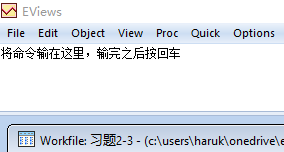
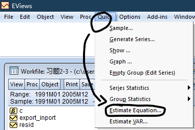
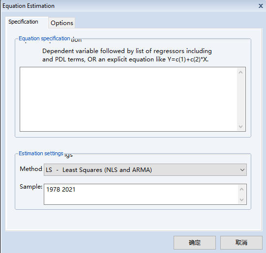
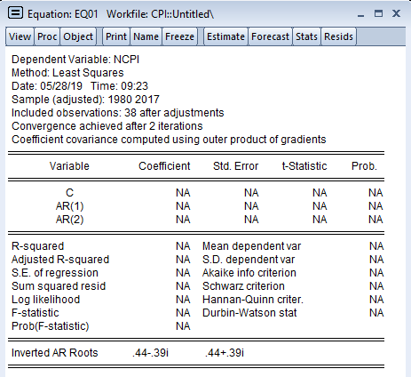
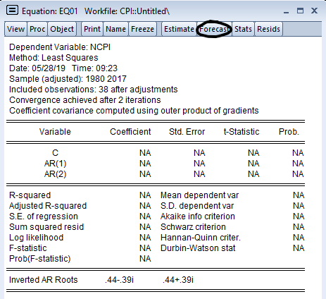
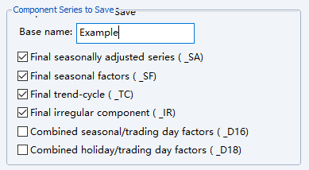
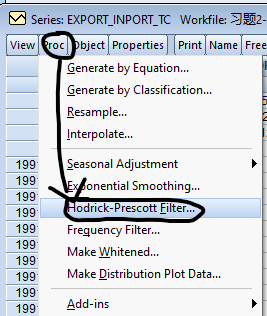
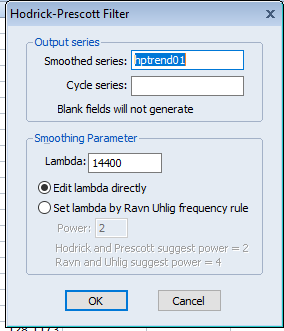

# EViews Order

>***Code By Setsuna Kitahara***

>***2019-7-18***

>***使用软件版本：EViews 7.2***

---

## 写在前面

没记错的话，这大概是老夫从小到大挂的第一个与计算机相关的课程

耻辱，相当的耻辱

所以为了能安心过补考，写了这么一个MarkDown

肯定没办法面面俱到，但是会尽可能整理相关的资料

## 通用的上机注意事项

- 本程序不区分大小写，该程序会认为APPLE与apple是同一回事
- 本程序会不提示覆盖现有的数据，因此如果类似于RESID和C这种数据有意义的话请尽快备份
- 接上一条，如果你觉得需要比较预测结果的话，请按下预测结果上方的**Freeze**按钮

- 请务必规范数据命名，具体细节可以因人而异，但至少你得看得懂
- 接上一条，请避开程序预留的名称，包括但不限于C，RESID等

## 差分运算

在主窗口命令窗口打入

`genr [存储目标] = D([目标], [一阶差分次数], [差分阶数])`

**[存储目标]** = 计算结果存储的变量

**[目标]** = 要进行计算的变量

**[一阶差分次数]** = 默认为1，若为n，取第n次一阶差分数据

**[差分阶数]** = 默认为1，若为n，取n阶差分数据，若一阶差分次数不为0，则先进行一阶差分

---
## 回归方程模型
### 位置
*参考PPT：第二讲*

主窗口菜单栏 ~ Quick菜单 ~ Equation Estimation

### 命令输入框

`[因变量] [常数] [自变量]`

**[因变量]** 以及 **[自变量]** 不解释

如果认为回归中包含常数，则增加，一般的，**[常数]** = c

如果认为前一个（或前几个）变量应该作为后面的自变量，在末尾加入 **[变量(-n)]**

n即为取前n个变量，如果n为区间，写为 **(-min to -max)**

*例：(-1 to -4)即为取前1个到前4个变量*

自变量可包含自动序列

*例：log(a)：取变量a的对数作为自变量*

### 估计方法
在下拉框中选择，一般选择“LS”（最小二乘法）
### 结果解读

**重点部分将以粗体显示**

| 名称                      | 翻译/解读                                               |
| ------------------------- | ------------------------------------------------------- |
| **Coeffcient**            | **回归系数，对应自变量的系数**                          |
| Std.Error                 | 标准差，系数可信度，越小越好                            |
| t-Statistic               | t统计量，检验系数为0的假设 *参照：PPT第一讲最后部分*    |
| **Prob.**                 | **概率，系数为0的概率，一般不能超过0.05**               |
| **R-squared**             | **R2统计量，预测回归好坏，越接近1回归越准**  |
| Adjusted R-squared        | 清除R2中对模型没有解释力的新增变量后的统计量 |
| S.E. of regression        | 回归标准差                                              |
| Sum squared resid         | 残差平方和                                              |
| Log likelihood            | 对数似然函数值                                          |
| F-statistic               | F统计量，联合检验系数为0的假设（常数截距除外）          |
| Prob(F-statistic)         | F统计量下的P值，联合检验系数为0的概率                   |
| Mean dependent var        | 因变量均值                                              |
| S.D. dependent var        | 因变量标准差                                            |
| **Akaike info criterion** | **AIC值，越小越好**                                     |
| Schwarz criterion         | SIC值，AIC的替代，越小越好                              |
| Hannan-Quinn criter.      | HQC值                                                   |
| Durbin-Watson stat        | D-W统计量，衡量残差一阶序列相关性                       |
---
## 回归预测
### 位置
在回归结果页面上点击**Forecast**按钮

### 预测页面

| 名称                                          | 解读|
|----------------------|-|
| Forecast name                                 | 预测值存放用的变量名，必填                                   |
| S.E.(optional)                                | 预测标准差存放用变量名，按需                                 |
| Method                                        | 预测方法（见下）                                             |
| Output                                        | 输出（见下）                                                 |
| Forecast sample                               | 预测区间                                             |
| Insert actuals for out-of-sample observations | 用实际值充填预测范围外的数据，若不勾选，此类数值将记为**NA** |
### 预测方法
| 名称       | 解读                                               |
| ---------- | -------------------------------------------------- |
| Dynamic    | 动态：从预测样本的第一期计算多部预测               |
| Static     | 静态：利用滞后因变量的实际值计算后一个值预测的结果 |
| Structural | 结构：若勾选，预测ARMA项时将忽略残差项进行预测     |
### 输出
| 名称       | 解读                           |
| ---------- | ------------------------------ |
| graph      | 若勾选，将显示预测图           |
| evaluation | 若勾选，将显示预测效果统计结果 |

---

## X-12季节调整

*参考：PPT第五讲前半部分*

### 定义

#### 季节调整

在原序列中剔除季节波动因素

#### 四种变动要素

| 名称         | 含义                                           | 简称 |
| ------------ | ---------------------------------------------- | ---- |
| 长期趋势要素 | 经济时间序列长期的趋势特性                     | T    |
| 循环要素     | 数年为周期的一种周期性变动                     | C    |
| 季节要素     | 以12个月或4个季度为周期的周期性影响            | S    |
| 不规则要素   | 又称随机因子、残余变动或噪声，其变动无规则可循 | I    |

### 注意

X-12季节调整仅适用于时间频率为**季度**或者**月度**的数据，其他频率的数据不适用该调整

如果上机时发现该功能不可用，请检查时间频率设置是否有误

### 位置

点开需要进行该处理的窗口，Proc按钮 ~ Seasonal Adjustment ~ Census X12...

### 对话框中的输出设置

注：以下复选框需要至少勾选一项，最后两个非重点

| 名称                             | 解读                                      | 包含变动要素 |
| -------------------------------- | ----------------------------------------- | ------------ |
| Base name                        | 输出数据的统一前缀                        |              |
| Final seasunally adjusted series | 勾选则输出季节调整后序列，后缀为_SA       | T/C/I        |
| Final seasonal factors           | 勾选则输出最后季节因子，后缀为_SF         | S            |
| Final trend-cycle                | 勾选则输出最后的趋势-循环，后缀为_TC      | T/C          |
| Final irregular component        | 勾选则输出最后的不规则要素分量，后缀为_IR | I            |

## HP滤波分解

### 来历以及用途

英文全称为**H**odrick-**P**rescott Filter

用于区分季节调整后的趋势数据和循环数据（也就是上一部分提到的TC序列）

### 位置

推荐先进行上上一部分提到的操作，将数据进行X-12季节转换，输出其“趋势-循环”序列

然后，打开该序列，Proc按钮 ~ Hodrick-Prescott Filter

### 对话框选项

| 名称            | 解读                                        |
| --------------- | ------------------------------------------- |
| Smoothed series | 输出趋势序列的名称，不写则不输出            |
| Cycle series    | 输出循环（波动）序列的名称，不写则不输出    |
| Lambda          | 一般为系统默认，无需手动指定 |

## 协整

（待补充）

## ARIMA

### 定义

AR：自相关系数

MA：偏自相关系数

I：差分

（待补充）

### 预处理：平稳性检验和纯随机性检验

（待补充）

### 处理：ARIMA+结果分析

（待补充）

### 预测：公式以及结果

（待补充）
